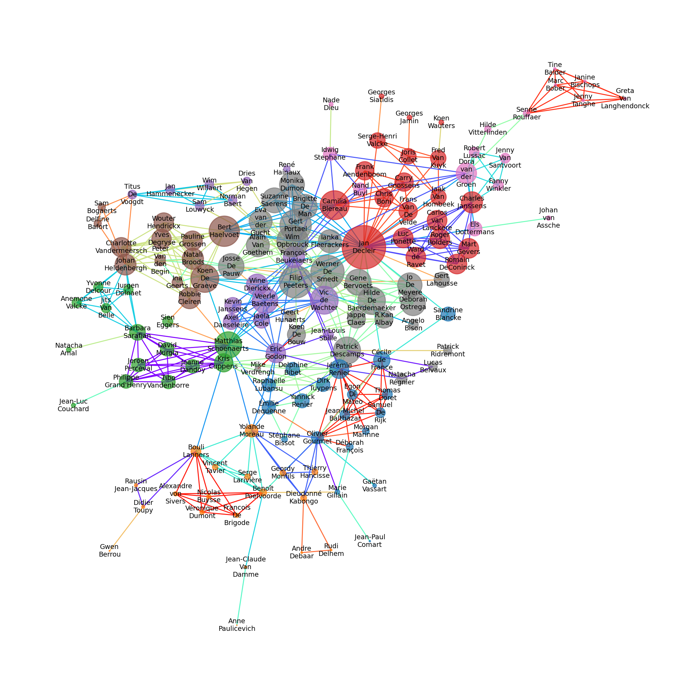

# Connectivity in the world of actors, an interpretable social graph structure?

**[Website available here !](https://epfl-ada.github.io/ada-2022-project-teamlovelace/)**

Or serve locally, by using for instance ``python -m http.server 8080 --directory docs``.

Finalized notebook source code is available under `story/*.ipynb`, and are rendered on the website. Other source code, as well as exploration and draft notebooks are available under `src/*.ipynb`.

## Project description (P2 milestone)

### Abstract

The well-known concept of [six degrees of separation](https://en.wikipedia.org/wiki/Six\_degrees\_of\_separation) descibes that one can link anyone to any other person by a "friend of a friend" chain of length six. Our project stems from this idea : we aim to analyze the graph of movie actors formed by linking actors having played in the same movie, or by various similarity metrics. This field is called SNA, standing for Social Network Analysis [@tabassum_2018] and has been quite active in the last decade. With this in mind, we want to look at how our social graph can relate to real world's social interactions. Our main approach consists in investigating the connectedness of actors in different subsets of our graph, according to different features such as countries and release year. We can ask ourselves how similarities between actors reflect themselves in the connectedness of actors. Can the time evolution of the social graph reflect geopolitical events, and reveal information about the influence of star actors on the future career of newcomers ?

### Research Questions

* How relationships change depending on the subset we are focusing on (movie genres, movie languages, actor gender, actor nationality, ...). Furthermore, how these graphs change over time and can hypothetically reflect historical events ?
* What features are good predictors of connectivity, clustering ? Do hubs appear, and under what conditions ?
* How can we interpret said clustering of actors ?
* How does information (i.e. features) spread throughout the edges of the graph (that is, measuring correlation decay as a function of distance) ? How much of an influence does an actor have on its neighbours ?
* Our null hypothesis is that the world of actors follows the same rules as real-life social networks : six-degree separation rule, power law distribution of degrees, etc. Therefore, we desire to show how this null hypothesis can be applied and interpreted for our actors relationships dataset.


### Additional Datasets

### From wikidata

We can complement information about actors using Wikidata. We have already resolved about 41% of actor nationalities, 18% of movie tomato scores, as well as 6% of actor ethnicities, which is 10% of character ethnicities. For this, we built dictionnaries from the freebaseIDs of actors/movies/ethnicities to the values we seeked, the reason being that the original dataset provides the freebaseIDs. This was done by querying all wikipedia entries of actors/movies/ethnicities where the freebaseIDs is known and were the value of interrest was defined. This method can also be applied to resolve other values of interest about actors and movies.

#### Ethnicities

[query](https://query.wikidata.org/#SELECT%20DISTINCT%20%3FfreebaseID%20%3Fname%20WHERE%20%7B%0A%20%20%3Fitem%20p%3AP646%20%5Bps%3AP646%20%3FfreebaseID%5D.%20%23get%20the%20freebaseID%0A%20%20%3Fitem%20rdfs%3Alabel%20%3Fname.%20%20%20%20%20%20%20%20%20%20%20%20%20%23get%20the%20name%20of%20the%20enthnic%20group%0A%20%20%3Fitem%20p%3AP31%20%5Bps%3AP31%20wd%3AQ41710%5D.%20%20%20%20%20%23get%20only%20the%20items%20whose%20%22instance%20of%22%20is%20%22ethnic%20group%22%0A%20%20filter%28lang%28%3Fname%29%20%3D%20%22en%22%29%20%20%20%20%20%20%20%20%20%20%23get%20the%20names%20in%20english%0A%7D)


```
SELECT DISTINCT ?freebaseID ?name WHERE {
  ?item p:P646 [ps:P646 ?freebaseID]. #get the freebaseID
  ?item rdfs:label ?name.             #get the name of the enthnic group
  ?item p:P31 [ps:P31 wd:Q41710].     #get only the items whose "instance of" is "ethnic group"
  filter(lang(?name) = "en")          #get the names in english
}
```

#### Nationalities

Two queries joined together

[query1](https://query.wikidata.org/#SELECT%20DISTINCT%20%3FfreebaseID%20%3Fnationnality%20WHERE%20%7B%0A%20%20%3Fitem%20p%3AP646%20%5Bps%3AP646%20%3FfreebaseID%5D.%0A%20%20%3Fitem%20wdt%3AP106%20%3Foccupation.%0A%20%20%3Fitem%20p%3AP27%20%5Bps%3AP27%20%3Fnationnality%5D.%0A%20%20VALUES%20%3Foccupation%20%7B%20wd%3AQ33999%20wd%3AQ10800557%20wd%3AQ10798782%20%7D%0A%7D%0A%0A)

```
SELECT DISTINCT ?freebaseID ?nationnality WHERE {
  ?item p:P646 [ps:P646 ?freebaseID].
* ?item wdt:P106 ?occupation.
  ?item p:P27 [ps:P27 ?nationnality].
  VALUES ?occupation { wd:Q33999 wd:Q10800557 wd:Q10798782 }
}
```

[query2](https://query.wikidata.org/#SELECT%20DISTINCT%20%3Fnationnality%20%3FnationnalityLabel%20WHERE%20%7B%0A%20%20%3Fitem%20p%3AP646%20%5Bps%3AP646%20%3FfreebaseID%5D.%0A%20%20%3Fitem%20wdt%3AP106%20%3Foccupation.%0A%20%20%3Fitem%20p%3AP27%20%5Bps%3AP27%20%3Fnationnality%5D%0A%20%20VALUES%20%3Foccupation%20%7B%20wd%3AQ33999%20wd%3AQ10800557%20wd%3AQ10798782%20%7D%0A%20%20SERVICE%20wikibase%3Alabel%20%7B%20bd%3AserviceParam%20wikibase%3Alanguage%20%22en%22.%20%7D%0A%7D%0ALIMIT%20348) (to bypass the query service timeout)

```
SELECT DISTINCT ?nationnality ?nationnalityLabel WHERE {
  ?item p:P646 [ps:P646 ?freebaseID].
  ?item wdt:P106 ?occupation.
  ?item p:P27 [ps:P27 ?nationnality].
  VALUES ?occupation { wd:Q33999 wd:Q10800557 wd:Q10798782 }.
  SERVICE wikibase:label { bd:serviceParam wikibase:language "en". }
}
LIMIT 348
```

#### Tomato Scores

[query](https://query.wikidata.org/#SELECT%20DISTINCT%20%3FfreebaseID%20%3FtomatoScore%20WHERE%20%7B%0A%20%20%3Fitem%20p%3AP646%20%5Bps%3AP646%20%3FfreebaseID%5D%3B%0A%20%20%20%20%20%20%20%20p%3AP444%20%3FreviewScoreStatement.%0A%20%20%3FreviewScoreStatement%20pq%3AP459%20wd%3AQ108403393%3B%0A%20%20%20%20%20%20%20%20%20%20%20%20%20%20%20%20%20%20%20%20%20%20%20%20ps%3AP444%20%3FtomatoScore.%0A%7D)

```
SELECT DISTINCT ?freebaseID ?tomatoScore WHERE {
  ?item p:P646 [ps:P646 ?freebaseID];
        p:P444 ?reviewScoreStatement.
  ?reviewScoreStatement pq:P459 wd:Q108403393;
                        ps:P444 ?tomatoScore.
}
```

### Methods

#### Preprocessing and selection of additional datasets

After a first transcription of the raw dataset into our notebook (preprocess.ipynb) (loading of `.txt` and `.tsv` files), we decided first to explore it without any additional datasets. First, we tried to verify the correctness of our data as much as we could and cleaned any strange looking value such as a height of 510 meters or an age of -7986 ! Then by exploring and analyzing the included features, we realized a lot of information was missing (for instance the actors' nationalities). This convinced us to seek additional datasets. 

We then proceeded to reorganise our raw datasets by merging and splitting them. This resolved some of the missing value and combined relevant and new data about distinct entity classes in distinct tables.

Essentially, the preprocessing step was actually focused over going back and forth with the exploratory analysis and the addition of new datasets.


   * `src/preprocessing.ipynb` : load raw data and generate pickles, such that other exploration notebooks can easily access sanitized data


#### Exploratory analysis on the datasets (node-only exploration)


We aimed to identify correlations and time evolutions in our data. For this we used classical data analysis methods, rather than directly working with graphs. Our exploration is organised in 3 separate Jupyter notebooks, each questioning certain hypotheses we had about the data. 

Notebooks :
   * `src/exploration_actors_time.ipynb` : For this notebook, we wanted to see how actors progressed in their career. By using information about the movie ratings and revenue, we expected to discover an upward trend in the fame of an actor. We didn't find anything conclusive so far.
   * `src/exploration_actors_features.ipynb` : This second notebook was essentially dedicated to the exploration of the nationalities (both movies and actors nationalities), the exploration of the ethnicities. Moreover, we used it to peek deeper into the gender of movies characters. The overall goal was to cluster the data and try to extract relevant information that could link actors to movies depending on several features.
   * `src/exploration_temporal_graph.ipynb` : This notebook shows an example of a data pipeline to create and show dynamic/temporal graph. While the results are not that great yet and can be improved further, it still shows that we can handle this kind of data transformation.


#### Graph analysis (node and edge exploration)

Then, for a theoretical background on Social Network Analysis, we will base ourselves on [Tabassum 2018](https://www.researchgate.net/publication/324575362\_Social\_network\_analysis\_An\_overview?enrichId=rgreq-c79a6d16ab4fd028766f9a8985c87c93-XXX\&enrichSource=Y292ZXJQYWdlOzMyNDU3NTM2MjtBUzo4MzU2MTAzMTkyODIxNzZAMTU3NjIzNjQzMzIxMw%3D%3D\&el=1\_x\_3\&\_esc=publicationCoverPdf)) (in which mathematicals details are given). We will try to apply various methods (from the paper, and the ADA course) to help answer the questions posed above.

A few examples include :

   * Centrality : which actors contribute the most to the graph connectivity ?
       * Degree : how much connections an actor has
       * Betweenness : how much the connectivity of the network depends on this actor, i.e. do these actors lie at intersections of groups ? ("Node betweenness b measures the extent to which a node lies between other nodes in the network and can be computed as the percentage of shortest paths that pass through the node")
       * PageRank : eigenvalue centrality
       * -> do these algorithms/measures give different results, i.e. different ways of defining the importance of an actor ?
   * Network size : is the network of actors "tight" or "spread out" ?
       * Diameter : "Leskovec et al. (2005) discovered that, for certain types of real-world networks, the effective diameter shrinks over time, contradicting the conventional wisdom of increasing diameters" -> does this hold up ?
       * "Average" degree : be careful with the power law !!! (c.f. ADA lecture on how to deal with this)
       * Clustering coefficient : "Small-world networks (Watts and Strogatz, 1998), such as the ones we find in real social contexts, are characterized by high global clustering coefficients, meaning that the property of transitivity among nodes emerges more often and in a stronger way, increasing the probability of clique formation."
   * Clustering :
       * Girvan-Newman : find clusters, detect communities. Useful for isolating sets of important features, and identifying graph subsets for more in-depth exploration
       * Hierarchical : provide a "hierarchy" of actors, in order of betweeness. This links back to the centrality analysis
   * Time evolution :
       * Characterize growth models of the actor graph : how can we model the addition of new actors (nodes) the the network ? Where to new actors connect to ? Uniformly ? Are they more likely to connect to high-profile actors (Albert-Barabasi model, which produces a power law for degrees) ?
       * Link Prediction : given the current network, can we predict which actors new movies will pick, i.e. what new links will appear between nodes ?
       * Paper, section 6.1 : how the model of growth of a network can be associated to a specific power law -> **this could explain the 3 regimes observed in initial graph analysis ! The network grows differently in time, giving rise to a superposition of power laws !**
   * Multiclass logistic regression : see which features are highly correlated or good predictors of appartenance to a community/clustering
   * Diffusion algorithms : study of the long-range correlation of features

Notebooks :

* `src/exploration_actor_graph.ipynb` : construction of the actor graph on the entire dataset, and some global heuristics (degree distribution that might have 3 regimes, connectivity, etc.)
* `src/exploration_belgian_actors.ipynb` : a more fine-grained analysis on a small subgraph of Belgian actors, 144 nodes and 473 edges. We explore some heuristics, compare and identify good centrality measures, interpret clusterings, and do some visualization.


*Belgian actor graph. Nodes are sized according to eigenvalue centrality and are colored according to (Louvain) community, and edges are colored according to the movie.*

#### Final review

Compose the DataStory around our datasets and create the GitHub website using [Quarto](https://quarto.org/) for the final submission.

### Timeline

   * Exploratory analysis on the datasets (mixed with hypothetical additional datasets) : 18.11.2022
   * Determination of the subsets of interest : 24.11.2022
   * Projet pause to allow work on homework 2
   * **Homework 2 submission : 02.12.2022**
   * Graph analysis (Clustering, time evolution, ...) : 08.12.2022
   * Write site and story : 15.12.2022
   * **Milestone 3 submission : 23.12.2022**

### Organization

   * Exploratory steps : Teammate Arthur, Dario, Nicolas, Nicole
   * Graph theory and network size investigation : 1 person
   * Centrality analysis : 1 person
   * Clustering of the actors graphs : 1 person
   * Investigation of time dependency into the graphs  : 1 person
   * Composition of the DataStory : 2 people
   * Realization of the website : 2 people

## Technical details

### Data

Original data from :
- [http://www.cs.cmu.edu/~ark/personas/](http://www.cs.cmu.edu/~ark/personas/)
- Wikidata (see Additional Datasets)

### Website build

Building the website requires [Quarto](https://quarto.org/). Run ``quarto render story`` to build to the `docs` folder.

### File structure

See [``tree.txt``](https://github.com/epfl-ada/ada-2022-project-teamlovelace/blob/main/tree.txt) for the full file structure of the project.

### Pipeline

Run pipeline :

```sh
./runall.sh
```

### Conda environment

Install a replica of the conda environment by running

```sh
conda env update -n ada2022teamlovelace --file env.yaml
conda activate ada2022teamlovelace
```

To re-export with updated dependencies (this is also run in ``runall.sh``), run

```sh
conda env export -n ada2022teamlovelace > env.yaml
```